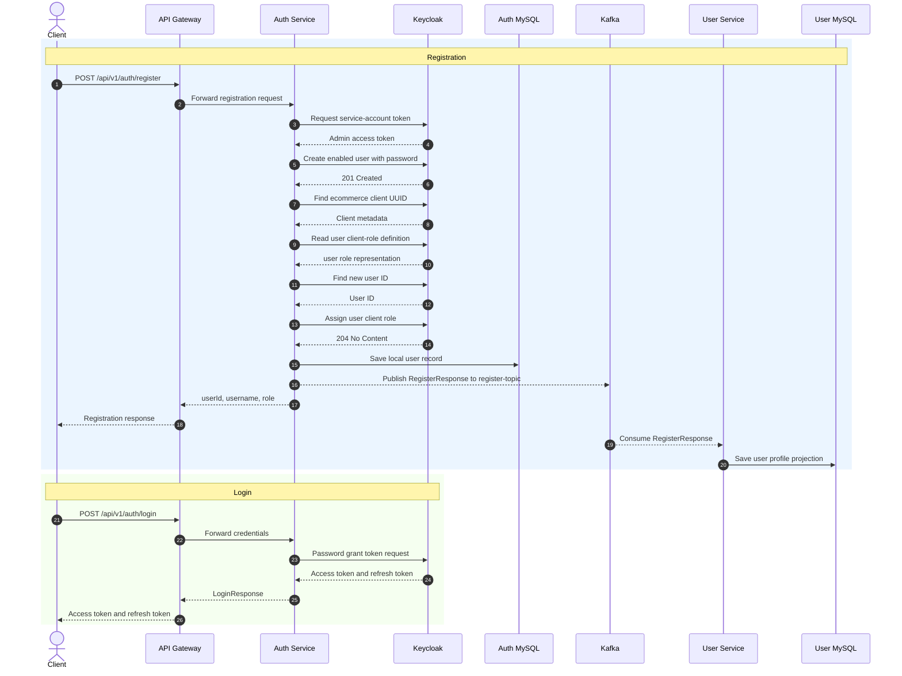
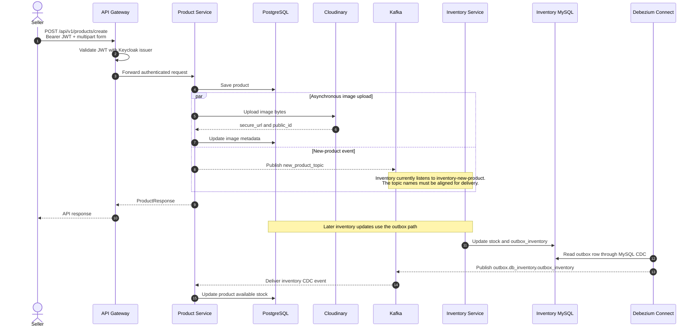
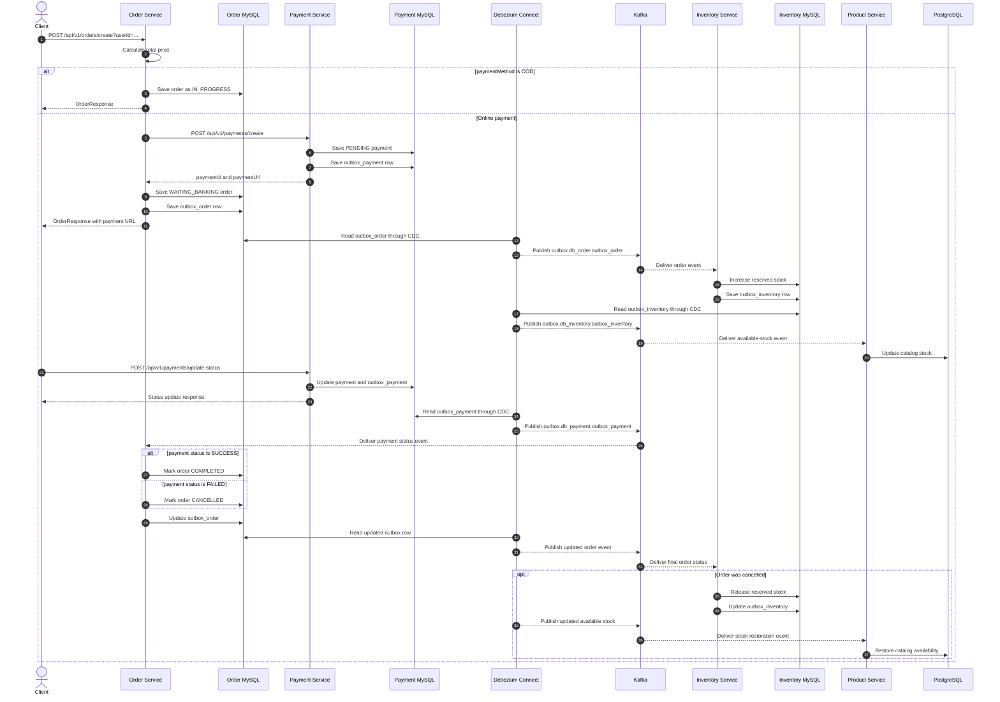
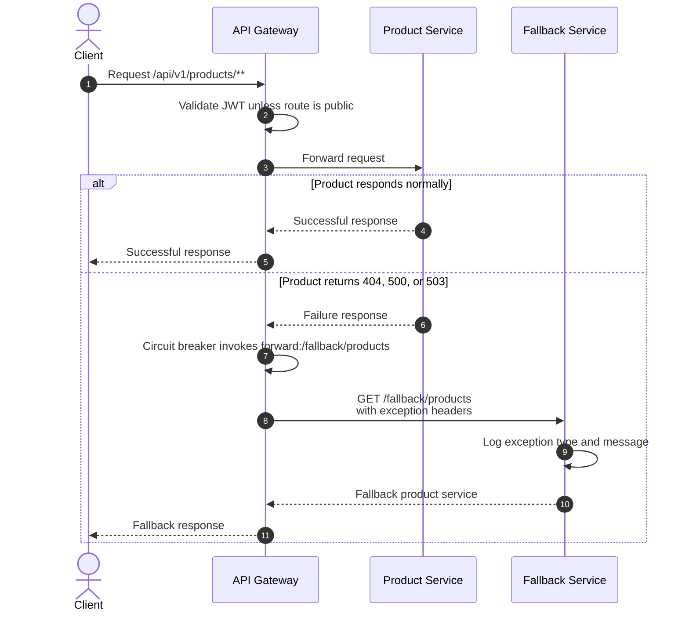

# Ecommerce Sequence Diagrams

These diagrams describe the main runtime flows implemented by the services in this repository. Solid arrows are synchronous HTTP/database calls; dashed arrows are responses or asynchronous event delivery.

## 1. Registration and login

## 2. Product creation and inventory synchronization

## 3. Order, payment, and inventory saga

The gateway has no order route at present, so the client calls order service directly in this flow.

## 4. Product circuit-breaker fallback

## Current integration constraints

The diagrams show the intended end-to-end behavior while preserving the names used by the code. These checked-in settings need alignment before every path can run as one local system:

- Gateway sends auth traffic to port `8081`, but auth service defaults to `8082`; Schema Registry also uses `8081`.
- Product service publishes `new_product_topic`, while inventory service listens to `inventory-new-product`.
- Order service and its hard-coded payment Feign client both use port `8084`.
- Gateway only routes authentication and product endpoints; order, payment, inventory, and user traffic is not routed through it.
- The two inventory listeners for `outbox.db_order.outbox_order` share the `inventory-group` consumer group, so Kafka treats them as competing consumers instead of delivering every event to both handlers.
- Debezium emits database column names, while several consumers read camel-case JSON fields. Confirm the connector payload field names or add an event transform/schema before relying on the CDC paths.
